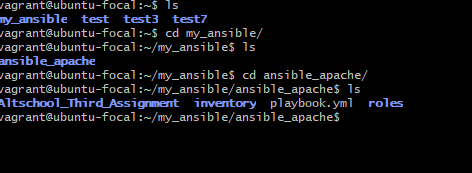

# TASKS
## Provision 3 Virtual Machines (VMs) - 1 master and 2 slaves. The slave VMs should run Ubuntu and CentOS respectively. Then, create an Ansible playbook to install Apache web server on both slave machines and copy website files to the /var/www/html directory on each slave machine.

### Reconfiguration of Vagrantfile

We had to change the Vagrantfile to make it possible to start three virtual machines at the same time. Also, we needed to increase the time limit from the default 5 minutes to 10 minutes so that the machines have enough time to load all the needed files. This change was made by adding config.vm.boot_timeout = 600 to the Vagrantfile. You can see the updated configuration in the image below.


After configuring the vagrantfile, run the **vagrant up** command and then create three different terminals and run the command below. 
```
vagrant ssh vm1
vagrant ssh vm2
vagrant ssh vm3
```
For this exercise, VM1 will serve as our Master. After confirming the successsful integration of all VM's, we run **sudo apt/yum update** to ensure all the virtaual machines are updated to the latest repository. Furthermore, we need to perform the necessary installations. Run the following commands:
```
sudo apt install python3
sudo apt install ansible
```

### Allowing SSH configuration Across all Virtual Machines
Firstly, we begin  by generating the ssh keys for vm1 using the command below:
```
ssh-keygen -t rsa
```

When prompted to choose a location to save the SSH key pair, the default location is typically the ~/.ssh/ directory. This is also my preferred choice, so simply press Enter to accept the default location.
```
cd .ssh/ or ~/.ssh/
ls
cat id_rsa.pub
```

It's crucial to emphasize that the private key (id_rsa) must be kept secure and never shared with anyone. On the other hand, the public key (id_rsa.pub) can be shared with others or added to servers or services that require SSH authentication. Therefore, we'll be using the public key to connect with the remaining VMs (vm2 and vm3). So copy this keys. 

#### Connecting Master to vm2
In the second terminal, navigate to the SSH directory using the cd .ssh/ command. Once inside, open the authorized_keys file using your preferred text editor, such as nano or vi. Paste the copied SSH keys from the master terminal into this file, then save and exit. After saving the changes, run the following commands:
``` 
cd  # To navigate to the home directory
sudo systemctl restart sshd  # This ensures that the system recognizes the changes made to the SSH configuration
```
Additionally, it's important to edit the SSH configuration file located at **/etc/ssh/ssh_config** to allow permission for certain configurations. To achieve this, use your preferred text editor and run the command **nano /etc/ssh/ssh_config**. Once inside the file, enable password authentication and public key authentication.  
  
It's important to note that while connecting VMs via SSH, you might encounter several challenges. I, too, faced hurdles during this process. Even after successfully establishing connections, access might be denied due to security concerns. In my case, the system flagged a potential risk of someone eavesdropping on my host machine. To address this issue, I took proactive measures. I created a new SSH key pair and replaced the old ones that were initially added on the slave machines. By doing so, I ensured the security of my connections and minimized the risks associated with unauthorized access or eavesdropping.  

 
```
ssh-keygen -f "/home/vagrant/.ssh/known_hosts" -R "192.168.50.11" #To remove the old host key

ssh -o StrictHostKeyChecking=no vagrant@192.168.50.11 #To verify the host key has been updated
```
Let's reconnect the VMs using the steps we've discussed earlier. Afterward, on your host/master machine, copy the IP addresses of the slave machines. Then, proceed to log in to one of your slave machines from the master. You can use the following command:
```
ssh vagrant@192.168.50.11
``` 
Once you've successfully logged into your slave machine from the master, you should find yourself inside the slave's terminal. Try creating a directory to confirm functionality. You can do this by executing the command below, just as depicted in the image below: 


### Creating Ansible Playbook
Before proceeding, ensure that Ansible and Python are installed on your virtual machine. If these dependencies haven't been installed yet, run the following commands::
```
sudo apt install python3

sudo apt install ansible
```
Let's organize our Ansible plays by creating a folder dedicated to them. Within this folder, we'll create another one specifically for playbooks related to configuring Apache server. 
```
#Create a folder for all Ansible plays
mkdir my_ansible

#Navigate into the newly created folder
cd my_ansible

#Create a folder for Apache playbooks
mkdir ansible_apache
``` 

#### Setting-up Inventory 
Then, let's proceed with creating the playbook file, as well as the folders for inventory to store inevntory files and roles for ansible roles. Run **touch playbook.yml** and **mkdir inventory && roles** for the directories.  
Within the inventory directory, with your preferred text editor create a file containing the ip addresses of your slave machines.

#### Setting-up Playbook file
Since our playbook file is already created as **playbook.yml**, open the playbook file with your text editor. Start configuring the playbook within this file. You can use the command **nano playbook.yml** to open it. It is also important to remember to start yml files with **(---)** at the top of the file.  

#### Setting-up Roles
Create all the neccessary directories according to the path shown in the image below and setup the handler. 
   
To setup ansible through a custom website, it is important to clone the repository of the website from github. This action is initiated on the same directory where the inventory file is located. The command is git clone.  
 
Configuring the main.yml file within the apache directory of the roles. 
   
Setting up the templates and varibales to be used within the tasks as vars. 
  
Configuring the tasks within the roles and apache directory.   
  

#### Testing and Checking Ansible Playbook
To confirm the configuration within your playbook is properly written, the command is executed **ansible-playbook -i inventory playbook.yml**.  
   
To check it once again  
 
Confirmation of website being live on respective ip addresses. For 192.168.50.11  
  
For 192.168.50.12  
